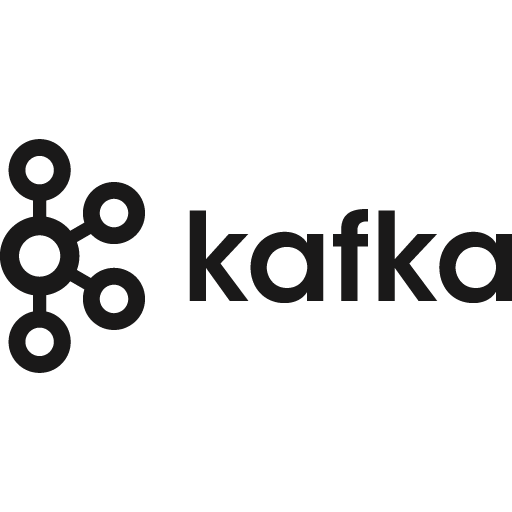
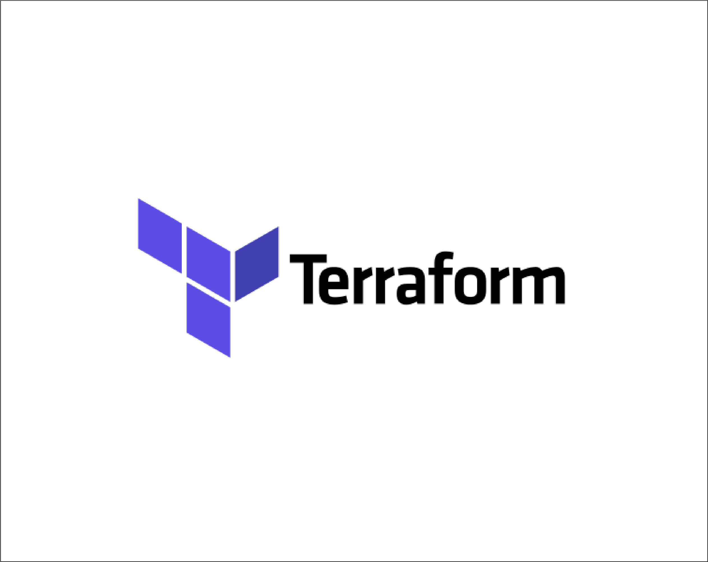
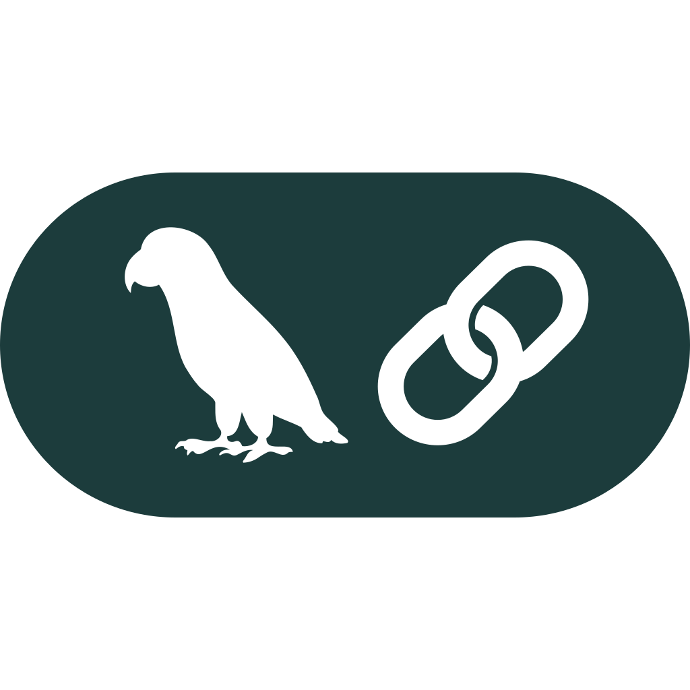
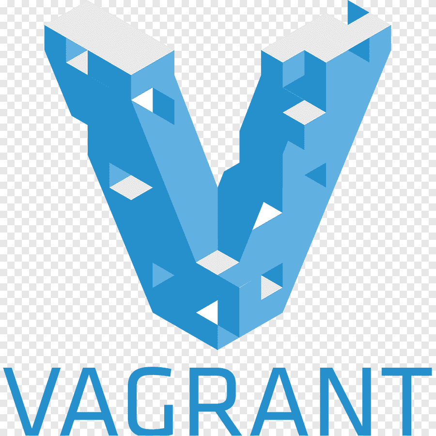
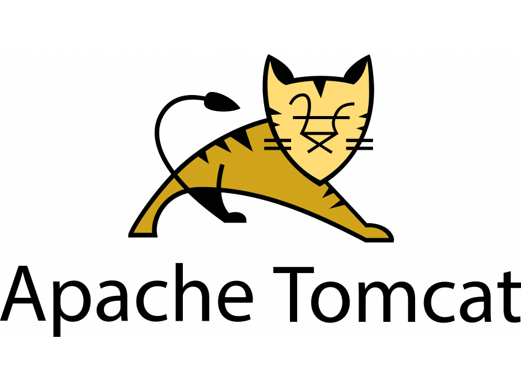

## Hi there 👋

<!--
**Rajarajeshwaripandikumar/Rajarajeshwaripandikumar** is a ✨ _special_ ✨ repository because its `README.md` (this file) appears on your GitHub profile.

Here are some ideas to get you started:

- 🔭 I
’m currently working on ...
- 🌱 I’m currently learning ...
- 👯 I’m looking to collaborate on ...
- 🤔 I’m looking for help with ...
- 💬 Ask me about ...
- 📫 How to reach me: ...
- 😄 Pronouns: ...
- ⚡ Fun fact: ...
-->

<b>Rajarajeshwari &nbsp;Pandikumar</b>
--------

<b> Connect with me:</b> &nbsp;&nbsp;&nbsp;&nbsp;  <a href="https://www.linkedin.com/in/rajarajeshwari-pandikumar-744592339" target="blank">
  

<table>
  <tr align="center">
    <td></td>
    <td></td>
    <td></td>
    <td></td>
    <td></td></table>
    <table>
    <td></td>
   <td></td> 
  <td></td>
  <td></td>
<td></td>
</table>
<table><td></td>
 <td></td>
<td></td>
<td></td>
<td></td>
</table>

  <table><td></td>
<td></td>
<td></td>
<td></td>
  <td></td>
</table>
<table><td></td>
  <td></td>
<td></td>
<td></td>
<td></td>
</table>
<table>
 <td></td>
<td></td>
<td></td>
<td></td>
 <td></td>
</table>
<table>
  <td></td>
 <td></td>
<td></td>
  </tr>
</tr>

</table>
 

